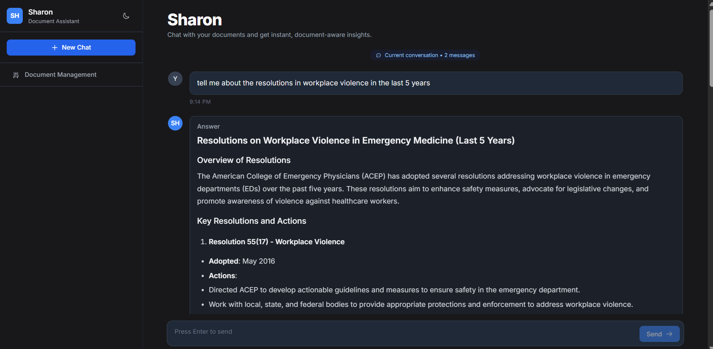
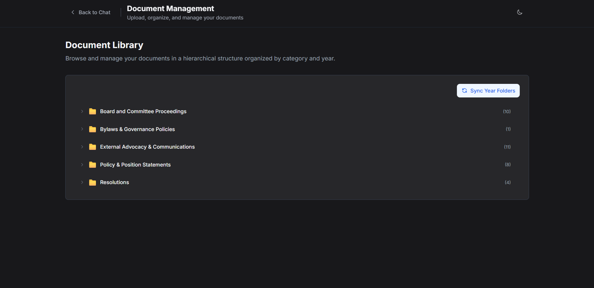
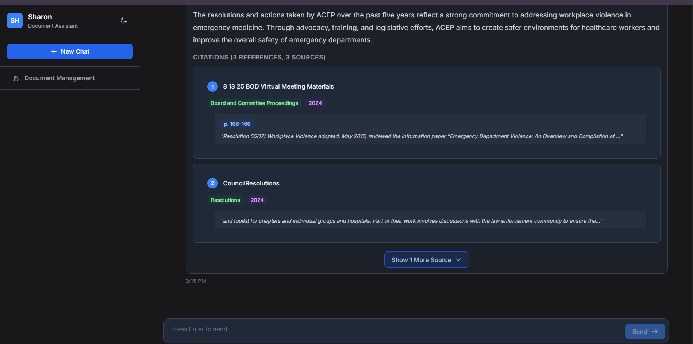

# Sharon AI Assistant

> A citation-aware document intelligence platform for legal, governance, policy, and meeting records.

Sharon helps teams find reliable information in large document collections without manual searching. Users can upload and organize source material, ask questions in natural language, and review the document details that support every answer.

## At a glance

| Capability | Description |
| --- | --- |
| Evidence-based answers | Generates responses from retrieved document passages rather than general knowledge alone. |
| Traceable sources | Returns citation details such as document title, category, section, date, year, and page range. |
| Document ingestion | Processes PDF, DOCX, TXT, and Markdown files, including OCR support for scanned PDFs. |
| Managed knowledge base | Organizes documents by category, year, title, and version. |

## Contents

- [Overview](#overview)
- [Agentic, category-aware RAG](#agentic-category-aware-rag)
- [Screenshots](#screenshots)
- [Architecture](#architecture)
- [Features](#features)
- [Supported categories](#supported-categories)
- [Technology](#technology)
- [Repository layout](#repository-layout)
- [Local setup](#local-setup)
- [API summary](#api-summary)
- [Docker](#docker)
- [Additional documentation](#additional-documentation)

## Overview

The application follows a retrieval-augmented generation (RAG) workflow:

1. A user uploads a PDF, DOCX, TXT, or Markdown document.
2. The backend extracts text and applies OCR where required.
3. The content is normalized, divided into structured sections, and chunked for search.
4. Each chunk is converted into an OpenAI embedding and stored in Supabase with metadata.
5. When a question is asked, the system retrieves relevant chunks from the selected category or across all categories.
6. An AI model produces a Markdown answer together with separate, structured citations.

## Agentic, category-aware RAG

Sharon uses an agentic-style RAG flow to keep each search focused on the right document domain. Before retrieval, the backend cleans informal or incomplete questions into a clearer search query. The selected category then determines which category-specific vector collection is searched.

For example, a question about a board decision is searched against **Board and Committee Proceedings**, while a question about an adopted policy is searched against **Policy & Position Statements**. This reduces irrelevant context and improves the quality of the grounded answer.

When the user selects **All Categories**, Sharon searches every category collection, balances the retrieved evidence across available categories, and returns citations for the supporting documents.

```text
User question
    ↓
Query understanding and normalization
    ↓
Selected category scope
    ↓
Category-specific vector retrieval
    ↓
Grounded answer with citations
```

## Screenshots

The Next.js frontend provides chat, document management, and citation review in one workspace.

### Chat workspace

Ask questions in natural language, select a document category, and stream grounded answers with source context.



### Document management

Browse and organize the knowledge base by category, year, and document version.



### Answers and citations

Review AI responses alongside structured citations: document title, section, page range, and category.



## Architecture

End-to-end flow from document upload through vector search to citation-backed answers:


| Layer | Responsibilities |
| :---- | :--------------- |
| **Next.js client** | Chat, citations, document management, themes, and exports |
| **FastAPI service** | File extraction, OCR, cleanup, document structure, and chunking |
| **AI & retrieval** | OpenAI embeddings, answer generation, Supabase vector search, and document metadata |

## Features

- Ask questions against a selected document category or all available categories.
- Receive answers grounded in retrieved document content.
- View citation metadata, including title, category, date, section, year, and page range.
- Upload and process PDF, DOCX, TXT, and Markdown files.
- Apply selective OCR to low-text PDF pages.
- Organize documents by category, year, title, and version.
- Replace previous embeddings when a newer version of a document is uploaded.
- Browse documents in a hierarchical management interface.
- Store chat history in the browser and support light and dark themes.
- Export conversations and inspect documents referenced by citations.

## Supported categories

The vector store is separated by document category to keep retrieval organized:

| Category | Supabase table |
| --- | --- |
| Board and Committee Proceedings | `vs_board_committees` |
| Bylaws & Governance Policies | `vs_bylaws` |
| External Advocacy & Communications | `vs_external_advocacy` |
| Policy & Position Statements | `vs_policy_positions` |
| Resolutions | `vs_resolutions` |

> The backend preserves one canonical category label for External Advocacy & Communications. Integrations should use the category values returned by `/categories` instead of hard-coding display strings.

## Technology

| Area | Tools |
| --- | --- |
| Frontend | Next.js 14, React, TypeScript, Tailwind CSS |
| Backend | FastAPI, Uvicorn, Pydantic |
| AI | OpenAI embeddings and chat models, LangChain |
| Search and storage | Supabase PostgreSQL with pgvector |
| Document processing | pdfplumber, PyMuPDF, python-docx, Tesseract |
| Deployment | Docker Compose, Vercel-compatible frontend, EC2-compatible backend |

## Repository layout

The codebase is split into a Next.js frontend, a Python ingestion and API layer, and shared deployment configuration.

### Frontend

| Path | Purpose |
| :---- | :------- |
| `frontend_2/` | Next.js 14 application shell |
| `frontend_2/app/` | Pages and server-side API proxy routes |
| `frontend_2/components/` | Chat, citation, management, and UI components |
| `frontend_2/context/` | Chat, document viewer, management, and theme state |
| `frontend_2/services/` | Document cache, exports, and telemetry |

### Backend and data pipeline

| Path | Purpose |
| :---- | :------- |
| `ingestion/` | Extraction, cleanup, structure, metadata, and chunking modules |
| `main.py` | FastAPI API, ingestion orchestration, retrieval, and Q&A |
| `supabase_functions.sql` | pgvector tables and similarity-search functions |

### Deployment and assets

| Path | Purpose |
| :---- | :------- |
| `docker-compose.yml` | Local or server container configuration |
| `config.json` | Shared IP and port configuration |
| `Images/` | Architecture diagram and frontend screenshots for documentation |

## Requirements

- Python 3.8 or later
- Node.js 18 or later
- npm
- An OpenAI API key
- A Supabase project with pgvector enabled
- Tesseract and Poppler when processing scanned PDFs outside Docker

## Local setup

### 1. Configure environment variables

Create a `.env` file in the repository root:

```env
OPENAI_API_KEY=your_openai_api_key
SUPABASE_URL=your_supabase_project_url
SUPABASE_KEY=your_supabase_key
```

`SUPABASE_SERVICE_KEY` may be used instead of `SUPABASE_KEY` for server-side operations.

### 2. Prepare Supabase

Run [`supabase_functions.sql`](supabase_functions.sql) in the Supabase SQL editor. It creates the category-specific vector tables, HNSW indexes, and RPC functions used by the retrieval layer.

### 3. Run the backend

```powershell
python -m venv .venv
.\.venv\Scripts\Activate.ps1
pip install -r requirements.txt
python main.py
```

The FastAPI service starts on `http://localhost:8000`. Interactive API documentation is available at `http://localhost:8000/docs`.

### 4. Run the frontend

```powershell
cd frontend_2
npm install
npm run dev
```

The web application starts on `http://localhost:3000`.

For a backend hosted elsewhere, provide the URL to the frontend runtime:

```env
BACKEND_URL=http://your-server:8000
NEXT_PUBLIC_BACKEND_URL=http://your-server:8000
```

## API summary

| Method | Route | Description |
| --- | --- | --- |
| `GET` | `/health` | Service health and runtime details |
| `GET` | `/v1/qa-status` | Q&A configuration status |
| `GET` | `/categories` | Valid document categories |
| `POST` | `/v1/ask` | Retrieve document context and generate an answer |
| `POST` | `/v1/preprocess` | Extract, clean, structure, and chunk one file |
| `POST` | `/v1/upload-and-preprocess` | Process a file, save its JSON output, and create embeddings |
| `POST` | `/v1/batch-upload-and-preprocess` | Process multiple documents in one request |
| `DELETE` | `/v1/delete-document` | Delete a document's embeddings from its category table |
| `GET` | `/documents_by_category/{category}` | List documents stored in a category |

## Docker

Build and start both services with:

```bash
docker compose up -d --build
```

The default mapping exposes the frontend on port `3000` and the backend on port `8000`.

`config.json` centralizes the server IP address and ports used by the backend CORS configuration and frontend build configuration. Update it before rebuilding containers for a new server address.

## Quality checks

From `frontend_2/`, run:

```bash
npm run typecheck
npm run lint
npm test
npm run build
```

For the backend, validate processing with a representative document and inspect the generated JSON, chunk metadata, Supabase records, and returned citations before production use.

## Additional documentation

- [Configuration guide](CONFIG_README.md)
- [Deployment guide](DEPLOYMENT_GUIDE.md)
- [Docker log guide](DOCKER_LOGS_GUIDE.md)
- [Troubleshooting guide](TROUBLESHOOTING.md)

## Notes for production use

- Keep OpenAI and Supabase credentials in environment variables; never commit them.
- Restrict CORS origins to approved frontend domains before public deployment.
- Use Supabase service credentials only in trusted backend environments.
- Verify legal or policy conclusions against the original cited document before relying on them.
